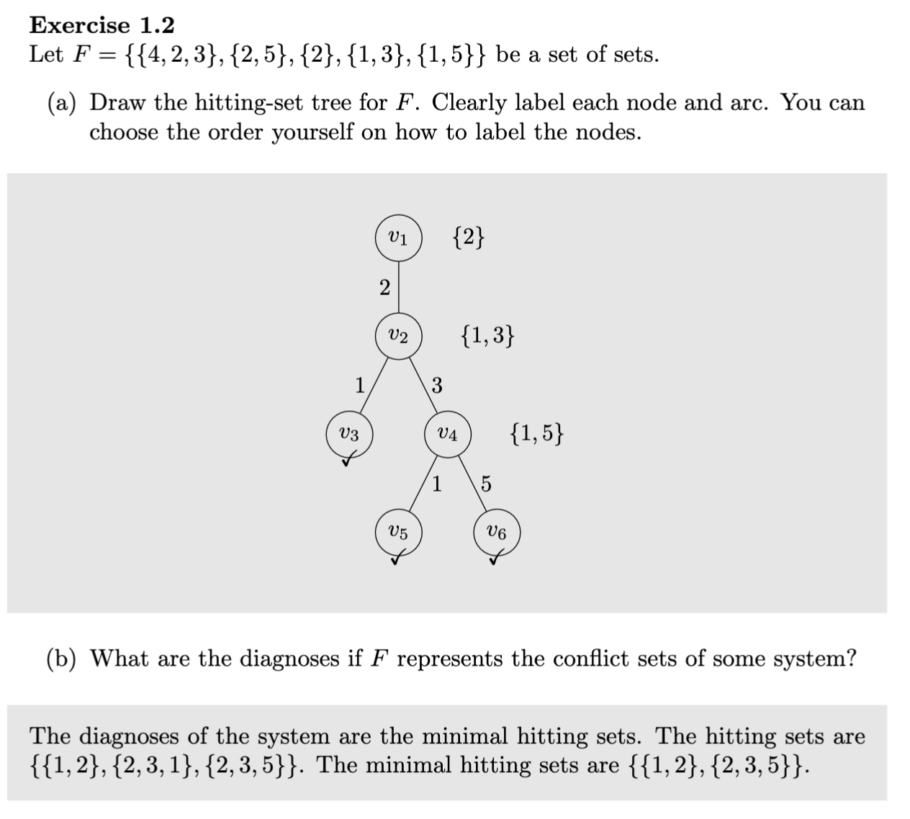

# Diagnose This: Circuit Diagnosis with Conflict and Hitting Sets

This project demonstrates model-based diagnosis of digital circuits using logical reasoning. It parses a simple circuit description, derives conflict sets via SAT/SMT (Z3), and computes hitting sets (minimal diagnoses). It also includes a small interactive game to pick conflict sets and compare against ground truth, plus a circuit plotter for visualisation.

Note: The hitting set computation is currently a stub in `hittingsets.py` and needs implementation to produce diagnoses. Everything else (conflict set retrieval, game scaffolding, plotting) is complete.

## Table of Contents

- [Assignment overview and how to approach it](#assignment-overview-and-how-to-approach-it)
- [The hitting set problem](#the-hitting-set-problem)
- [Key concepts](#key-concepts)
- [How it works](#how-it-works)
- [Why it works](#why-it-works)
- [Repository structure](#repository-structure)
- [Install](#install)
- [Usage](#usage)
- [Circuit file format](#circuit-file-format)
- [Core modules and APIs](#core-modules-and-apis)
- [Examples](#examples)
- [Troubleshooting](#troubleshooting)
- [Extending](#extending)

## Assignment overview and how to approach it

**Goal**: Develop a thorough understanding of the hitting set algorithm and model-based system diagnosis. Implement the hitting set algorithm discussed in the lectures and apply it to the provided conflict sets. Implement and compare multiple heuristics for building the search tree (at least two).

**What is provided**: This repository already parses circuits, builds Z3 constraints, and computes minimal conflict sets. A scaffold is provided for the hitting set algorithm in `hittingsets.py`. You may modify the provided code, but document any changes in your report.

### Suggested approach
0. Familiarise yourself with the codebase and the theory.
   - What are conflict sets? What are hitting sets? How are conflicts generated here?
   - Run `python main.py` on the example circuits and inspect the printed conflicts.
   - Read `hittingsets.py` to see where your implementation should go.
1. Choose a tree/structure for search.
   - Either implement a straightforward combination search, or Reiter’s HS-Tree.
   - Decide on an internal representation for nodes/edges and conflict coverage.
2. Compute all hitting sets.
   - Ensure every candidate set intersects each conflict set.
3. Filter to minimal hitting sets.
   - Remove supersets so only subset-minimal diagnoses remain.
4. Implement at least two heuristics for tree construction/expansion and compare.
   - Examples: choose the smallest conflict first; pick the most frequent component first; breadth-first vs depth-first expansion; cost-based component ordering.
   - Discuss the effect on correctness and runtime (time and/or node expansions).

Bonus: Create additional circuits and test more than two heuristics for extra credit (see grading sheet).

### Constraints
- Do not use external libraries to implement the hitting set algorithm (no NumPy, Pandas, PySAT, etc.).
- For collecting conflict sets you may use `z3-solver` (already included).
- Standard library usage is allowed (e.g., `itertools`, `collections`, `queue`, `random`).

### Report and submission
- Write a formal scientific report (≈4–8 pages, excluding appendices) describing your approach, implementation, heuristics, experiments, results, and conclusions. Follow the course guide’s “writing a programming report” and the assignment’s assessment form.
- Submit both: (1) the PDF report and (2) the code (zip). Include your name(s), student number(s), course, assignment, and date in both.
- Deadlines and contact information are communicated via Brightspace and the course manual.

## The hitting set problem

**Definition**: Given a universe `U` and a family of sets `C = {C₁, C₂, …, Cₖ}` with `Cᵢ ⊆ U`, a set `H ⊆ U` is a hitting set if `H ∩ Cᵢ ≠ ∅` for every `i`. A hitting set is **minimal** if no proper subset of it is also a hitting set.

In model-based diagnosis, `U` is the set of components, and `C` is the collection of (minimal) conflict sets. A diagnosis is exactly a hitting set of the conflict sets, and a minimal diagnosis is a minimal hitting set.

**Example**: Let `C = {{A, B}, {B, C}}` over `U = {A, B, C}`.
- Hitting sets include `{B}`, `{A, C}`, `{A, B}`, `{B, C}`, `{A, B, C}`.
- Minimal hitting sets are `{B}` and `{A, C}`.

**Complexity**: Deciding whether a hitting set of size ≤ `k` exists is NP-complete, and the number of minimal hitting sets can be exponential. For small circuits and few conflicts, enumeration is practical.

### How to solve it

1) Brute force over combinations (simple and fine for teaching/small inputs):
- Enumerate combinations of components in increasing size.
- Keep those that intersect every conflict set.
- Filter to minimal sets by removing any set that strictly contains another solution.

2) Reiter’s HS-Tree (systematic and scalable with pruning):
- Maintain a search tree where each node corresponds to a candidate hitting set `S(n)` (the set of edge labels on the path).
- If `S(n)` hits all conflicts, mark it as a (minimal) diagnosis leaf (BFS ensures minimality by cardinality/cost).
- Otherwise select an uncovered conflict `C` and expand a child for each `c ∈ C` by adding an edge labelled `c` (so child path is `S(n) ∪ {c}`).
- Pruning rules:
  - If `S(n)` is a superset of an already found diagnosis, prune (`superset check`).
  - Avoid duplicate elements along a path.
  - Use only minimal conflict sets as input to avoid redundant branches and ensure minimal diagnoses.
- Heuristics to reduce search:
  - Select the smallest conflict first.
  - Order components by frequency across conflicts (most frequent first).
  - Use BFS for cardinality-minimal diagnoses first, or cost-based priority if components have costs.

Implementation tip: For this assignment, a correct and readable brute-force enumerator with a clean minimality filter is sufficient. If you implement HS-Tree, add clear pruning and ordering heuristics and compare runtime/expansions.



#### HS-Tree in 6 steps (concise)

1. Select root conflict:
   Choose a conflict set to start with (commonly the smallest by cardinality) and use its elements to create the first-level branches.
2. Expand nodes:
   For each element in the current conflict set, create a branch (edge) labelled with that element; the node’s path labels form the candidate set `S`.
3. Select next conflict:
   At each node, pick a conflict set that is not yet hit by `S` (i.e., `S ∩ C = ∅`).
4. Continue expansion:
   Expand children for each element of this new conflict and repeat until all conflicts are intersected by `S`.
5. Collect hitting sets:
   Every root-to-leaf path whose `S` hits all conflicts is a diagnosis (use BFS/cost-ordering to obtain minimal ones first, otherwise filter later).
6. Minimise:
   Remove any diagnosis that is a strict superset of another to obtain minimal hitting sets only.

Pruning notes: prune any node whose `S` is a superset of an already found diagnosis; avoid repeating the same element along a path; always use minimal conflict sets.

## Key concepts

- **Component (fault flag)**: Boolean variable indicating whether a component’s behaviour is constrained (`False` = healthy) or unconstrained (`True` = potentially faulty).
- **Conflict set**: A set of components that cannot all be healthy given the observations (assuming they are all healthy makes the model UNSAT).
- **Minimal conflict set**: A conflict set with no proper subset that is also a conflict.
- **Hitting set / Diagnosis**: A set of components that intersects every minimal conflict set; corresponds to a hypothesis about faulty components.
- **Minimal diagnosis**: A diagnosis with no proper subset that is also a diagnosis; preferred by parsimony.
- **Soundness & completeness**: Using minimal conflict sets and exhaustive search or an HS-Tree with correct pruning yields exactly the minimal diagnoses.

## How it works

- **Model-based diagnosis**: A system is modeled with components that may be healthy or faulty. Observations about inputs and outputs are provided. If assuming a set of components are healthy leads to contradiction with the observations, that set is a conflict set. A diagnosis is a set of components that intersects every conflict set (a hitting set). Minimal diagnoses correspond to minimal hitting sets.
- **SMT encoding (Z3)**: Components are encoded as boolean fault flags. Gate behaviour is encoded with logical constraints. Observations are added as constraints. For each candidate set of healthy components, we check satisfiability. Unsatisfiable assumptions produce conflict sets; subsumption is used to keep only minimal conflicts.
- **Hitting sets**: Given minimal conflict sets, we compute all hitting sets and then filter to minimal ones. This step is left to implement in `hittingsets.py` (see guidance below).

## Why it works

- If a set of components, when assumed healthy, contradicts observations, then at least one in that set must be faulty → it’s a conflict set.
- Any diagnosis must include at least one component from every conflict set → diagnoses are hitting sets of the conflict sets.
- Minimal diagnoses are preferred by Occam’s razor; they correspond to minimal hitting sets, ensuring no superfluous faults are assumed.

## Repository structure

- `main.py`: CLI entrypoint to parse a circuit, compute conflict sets, run the hitting set algorithm, and (optionally) run the guessing game and plotter.
- `conflictsets.py`: Core logic to parse circuit files, build Z3 constraints, and compute minimal conflict sets.
- `hittingsets.py`: Placeholder for the hitting set computation from conflict sets → (hitting sets, minimal hitting sets).
- `guesscomponentsgame.py`: Interactive UI to choose conflict sets and a scoring utility to compare with ground-truth.
- `circuitplotter.py`: Draws circuits with `schemdraw` to `.circuit.svg` for visual reference.
- `circuits/*.txt`: Example circuit descriptions.
- `requirements.txt`: Python dependencies (`z3-solver`, `schemdraw`).

## Install

```bash
python3 -m venv .venv
source .venv/bin/activate
pip install -r requirements.txt
```

On macOS, you may need `brew install graphviz` if schemdraw backends require it, though the current usage draws simple SVGs.

## Usage

Run the main program (defaults to `circuit1.txt`):

```bash
python main.py
```

What it does:
- Reads `circuits/circuit1.txt`.
- Computes and prints minimal conflict sets.
- If any conflicts exist, calls hitting set computation to produce diagnoses (currently returns `(None, None)` until implemented).
- Optionally, enable the interactive game by setting `game = True` in `main.py`.
- Optionally, call `plot_circuit(document)` to open a schematic SVG.

Switching circuits: change `document` in `main.py` to one of `circuit1.txt` … `circuit7.txt` (files exist under `circuits/`).

## Circuit file format

Each circuit file defines components, wiring (behaviour), input observations, and output observations.

Example (`circuits/circuit1.txt`):

```text
COMPONENTS:
ANDG(A1)
ANDG(A2)
XORG(X1)
XORG(X2)
ORG(O1)
ENDCOMPONENTS

BEHAVIOUR:
IN1(X2)=OUT(X1)
IN2(A2)=OUT(X1)
IN1(O1)=OUT(A2)
IN2(O1)=OUT(A1)
ENDBEHAVIOUR

OBSERVATIONS:
IN1(X1)=1
IN2(X1)=0
IN2(X2)=1
IN1(A1)=1
IN2(A1)=0
IN1(A2)=1
ENDOBSERVATIONS

OUTOBSERVATIONS:
OUT(O1)=0
OUT(X2)=1
ENDOUTOBSERVATIONS
```

Conventions:
- Supported gates: `ANDG`, `ORG`, `XORG`.
- Inputs are referenced as `IN1(GATE)` and `IN2(GATE)`; outputs as `OUT(GATE)`.
- Behaviour section wires outputs to inputs, or uses constants `0|1` in observations.
- Observations fix boolean values for specific inputs/outputs.

## Core modules and APIs

### main.py

- `document = "circuit1.txt"`: Selects the input circuit file (resolved under `circuits/`).
- `game = False`: Toggle the guessing game.
- Workflow:
  1. If `game` is True: draw the circuit, accept user-chosen conflict sets, compute/print their hitting sets.
  2. Always: create `ConflictSetRetriever(join("circuits", document))`, call `retrieve_conflict_sets()` and print them.
  3. If there are conflicts: call `run_hitting_set_algorithm(conflict_sets)` and print hitting and minimal hitting sets.
  4. If `game` is True: compute a score versus ground-truth.

### conflictsets.py

`class ConflictSetRetriever` encapsulates parsing and SAT checking with Z3.

- `__init__(document_path)`: Reads and validates the circuit file; extracts observation variables and components; builds fault assumptions and observation constraints.
- `open_document() -> str`: Reads file contents.
- `validate_file()`: Ensures sections exist and that each component has exactly 1 `IN1` and 1 `IN2` connection declared across the file; raises on errors with a helpful message.
- `extract_in_observations() -> List[z3.BoolRef]`: Collects input variable symbols from `OBSERVATIONS`.
- `extract_out_observations() -> List[z3.BoolRef]`: Collects output variable symbols from `OUTOBSERVATIONS`.
- `extract_gates() -> Tuple[List[z3.BoolRef], List[z3.BoolRef]]`: Produces a list of gate fault flags (named like `A1_gate`) and corresponding gate output symbols (named like `A1`).
- `faulted(gate_out, logic_expr, fault_flag) -> BoolRef`: Encodes the relationship `fault_flag OR gate_out == logic_expr`.
- `find_corresponding_gate_type(comp_out) -> Callable`: Returns the Z3 boolean operator (`And`, `Or`, `Xor`) for the component.
- `find_inputs(comp_out) -> ((int,bool),(int,bool))`: Resolves the two inputs for a component; indices reference either observations or other components.
- `make_fault_assumptions() -> List[BoolRef]`: For each component, builds a constraint linking gate inputs/outputs with a fault flag.
- `extract_observations() -> List[BoolRef]`: Converts input and output observations into equality constraints.
- `powerset(s)`: Generates all non-empty subsets (used to brute-force healthy sets).
- `retrieve_conflict_sets() -> List[List[str]]`: Brute-forces over subsets of “healthy” components by setting selected fault flags to `False` and the rest to `True`. For each subset, checks satisfiability with observations. If UNSAT, records subset as a conflict set. Returns only minimal conflict sets as lists of symbol names.

Implementation notes:
- Each component has a dedicated boolean fault flag (e.g., `A1_gate`). Setting it `False` asserts the component behaves per logic; `True` relaxes the constraint, allowing arbitrary behaviour (i.e., potentially faulty).
- Conflict search is exponential in the number of components (powerset), which is acceptable for small circuits in the examples.

### hittingsets.py

- `run_hitting_set_algorithm(conflict_sets) -> (hitting_sets, minimal_hitting_sets)`: Currently returns `(None, None)`. Implement using either:
  - A simple breadth-first search over combinations to find all sets that hit every conflict; then filter to minimal.
  - Reiter’s HS-Tree for better performance.

Example brute-force outline:

```python
from itertools import combinations

def run_hitting_set_algorithm(conflict_sets):
    # conflict_sets: List[List[str]]
    all_comps = sorted({c for cs in conflict_sets for c in cs})
    hits = []
    for r in range(1, len(all_comps) + 1):
        for comb in combinations(all_comps, r):
            s = set(comb)
            if all(s & set(cs) for cs in conflict_sets):
                hits.append(sorted(s))
    # minimal filter
    minimal = []
    hits_sets = [set(h) for h in hits]
    for hs in hits_sets:
        if all(not (other < hs) for other in hits_sets):
            minimal.append(sorted(hs))
    return hits, minimal
```

### guesscomponentsgame.py

- `choose_components() -> List[List[str]]`: Text UI to let a user enter their own conflict sets (space-separated within a set, newline-separated across sets, "STOP" to end).
- `jaccard_similarity(set1, set2) -> float`: Jaccard index with empty-set handling.
- `score_function(hitting_sets, chosen_hitting_sets) -> float`: Matches each ground-truth hitting set with the best matching chosen set, penalises extras, returns percentage score.

### circuitplotter.py

- `plot_circuit(document)`: Dispatches to `plot_circuit_1` … `plot_circuit_7` based on filename.
- Each plot function draws a schematic consistent with its corresponding circuit file and opens `.circuit.svg` in a browser.

To open the circuit in a browser:
```
open -a "Zen Browser" .circuit.svg
open -a "Google Chrome" .circuit.svg
```

## Examples

Running `python main.py` on `circuit1.txt` produces output like:

```text
Actual conflict sets: [["A1_gate", "A2_gate"], ["X1_gate", "O1_gate"], ...]
Hitting sets: ...
Minimal hitting sets: ...
```

If there are no conflicts:

```text
This circuit works correctly, there are no faulty components!
```

To play the game, set `game = True` in `main.py`. You will be prompted to enter conflict sets and the tool will score your guesses.

## Troubleshooting

- File format errors such as missing sections or wrong number of `IN1`/`IN2` connections will raise exceptions with details. Fix the circuit file accordingly.
- If plotting does not open, ensure your system can open `.svg` files and that a default browser is configured.
- Large circuits may take longer due to the exponential conflict search; consider pruning or implementing a more efficient conflict search if needed.

## Extending

- Implement `run_hitting_set_algorithm` in `hittingsets.py` (see example above) to enable full diagnosis.
- Add new gates by extending `find_corresponding_gate_type` and the file parser; update `circuitplotter.py` if you want visual support.
- Optimise conflict retrieval by avoiding full powerset search or by using more advanced Z3 encodings.


